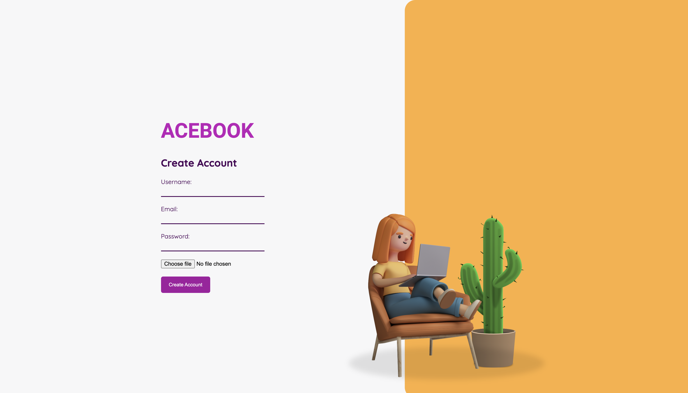
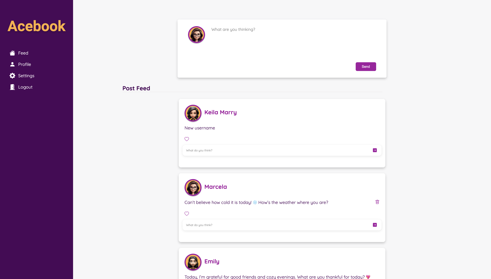
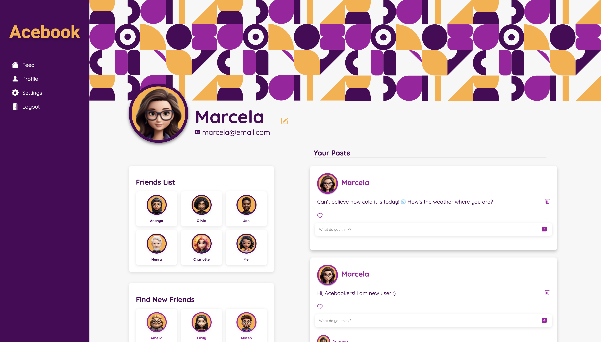

# Acebook: Facebook-like Application

The project is a Facebook-like application built using JavaScript and the MERN stack (MongoDB, Express, React, and Node.js).

Overview
Project Type: Facebook-like Application
Features: Account creation, login, profile, edit profile,  posting, delete post, commenting, delete comment liking, connecting with friends, feed that displays all posts and feed with posts by users.

## Tech Stack

For this app we will be using the following tech stack:
- JavaScript, React, Node.js, Express, MongoDB, HTML, CSS, JWT.

## Features

- Account Creation
- Login Page
- Feed
- Profile
- Create and Delete Posts
- Create and Delete Comments
- Like posts and comments
- Edit Profile informations
- Conect with other users

## Application

|   Description    |   Page Image    |
|:------------:|:----------------:|
|Account Creation Page| |
|Login Page| |
|Feed Page| |
|Profile| |
